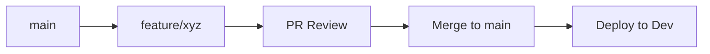
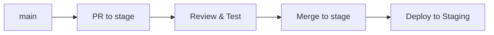
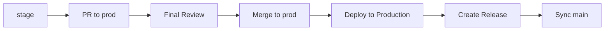
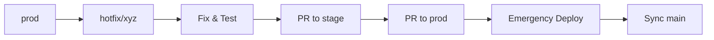

# Git Branching Strategy

This document outlines the Git branching strategy for the Cyrus project, following modern best practices for development, staging, and production environments.

## Branch Structure

### Core Branches

```
main (development) ← feature branches
   ↓
stage (staging)
   ↓
prod (production)
```

#### Main Branch (`main`)
- **Purpose**: Development environment
- **Stability**: Working but may contain new features under development
- **Deployment**: Automatically deployed to development environment
- **Merging**: Feature branches merge here first
- **Protection**: Requires PR approval and passing CI tests

#### Stage Branch (`stage`)
- **Purpose**: Staging environment for pre-production testing
- **Stability**: Tested features ready for final validation
- **Deployment**: Automatically deployed to staging environment
- **Merging**: Only `main` branch merges here (via PR)
- **Protection**: Requires PR approval and comprehensive testing

#### Production Branch (`prod`)
- **Purpose**: Production environment
- **Stability**: Stable, thoroughly tested code
- **Deployment**: Automatically deployed to production
- **Merging**: Only `stage` branch merges here (via PR)
- **Protection**: Requires multiple approvals and all checks must pass

### Supporting Branches

#### Feature Branches (`feature/*`)
- **Purpose**: Develop new features or enhancements
- **Naming**: `feature/description` or `feature/TICKET-123`
- **Base**: Branched from `main`
- **Merge target**: `main`
- **Lifecycle**: Deleted after merge

```bash
# Create feature branch
git checkout main
git pull origin main
git checkout -b feature/new-authentication

# Work on feature...
git add .
git commit -m "Add new authentication system"
git push origin feature/new-authentication

# Create PR to main
gh pr create --base main --title "Add new authentication system"
```

#### Hotfix Branches (`hotfix/*`)
- **Purpose**: Critical fixes for production issues
- **Naming**: `hotfix/description` or `hotfix/CRITICAL-123`
- **Base**: Branched from `prod` or `stage`
- **Merge targets**: `stage` and `prod` (and sync back to `main`)
- **Lifecycle**: Deleted after merge

```bash
# Create hotfix branch
git checkout prod
git pull origin prod
git checkout -b hotfix/security-patch

# Work on hotfix...
git add .
git commit -m "Fix critical security vulnerability"
git push origin hotfix/security-patch

# Hotfix automatically creates PRs to stage and prod
```

## Development Workflow

### 1. Feature Development



1. Create feature branch from `main`
2. Develop and test locally
3. Push branch and create PR to `main`
4. Code review and CI checks
5. Merge to `main` → auto-deploy to development

### 2. Staging Promotion



1. Create PR from `main` to `stage`
2. Staging review and validation
3. Merge to `stage` → auto-deploy to staging
4. Run comprehensive tests and UAT

### 3. Production Release



1. Create PR from `stage` to `prod`
2. Final production readiness review
3. Merge to `prod` → auto-deploy to production
4. Create GitHub release with version tag
5. Automatically sync `main` with production changes

### 4. Hotfix Process



1. Create hotfix branch from `prod`
2. Implement and test fix
3. Auto-create PRs to `stage` and `prod`
4. Expedited review process
5. Deploy to production immediately
6. Back-merge to `main` to keep branches in sync

## Branch Protection Rules

### Main Branch Protection
- Require pull request reviews (1 approver)
- Dismiss stale reviews when new commits are pushed
- Require status checks to pass before merging
- Require branches to be up to date before merging
- Restrict pushes that create files over 100MB

### Stage Branch Protection
- Require pull request reviews (2 approvers)
- Require status checks to pass before merging
- Only allow merges from `main` or `hotfix/*` branches
- Require conversation resolution before merging

### Production Branch Protection
- Require pull request reviews (2+ approvers)
- Require admin/maintainer approval
- Require status checks to pass before merging
- Only allow merges from `stage` branch (except hotfixes)
- Require conversation resolution before merging
- Enable automatic branch deletion after merge

## Automation Features

### GitHub Actions Workflows

1. **Branch Management** (`.github/workflows/branch-management.yml`)
   - Validates branch promotion rules
   - Runs tests on all environment branches
   - Auto-syncs branches after production deployment
   - Enforces branch protection policies

2. **Deployment Pipeline** (`.github/workflows/deployment.yml`)
   - Automated deployment to all environments
   - Build artifact management
   - Environment-specific configurations
   - Release creation and tagging

3. **Hotfix Management** (`.github/workflows/hotfix.yml`)
   - Validates hotfix branch structure
   - Auto-creates PRs for hotfix deployment
   - Expedited testing and deployment
   - Team notification system
   - Automatic cleanup of merged branches

### Environment Synchronization

After production deployment, the system automatically:
- Merges `prod` changes back to `main`
- Updates development environment with production state
- Prevents branch drift between environments

## Best Practices

### Commit Messages
Use conventional commits format:
```
type(scope): description

feat(auth): add OAuth2 integration
fix(api): resolve memory leak in session handler
docs(readme): update installation instructions
```

### Branch Naming
- Feature: `feature/add-user-roles` or `feature/TICKET-123`
- Hotfix: `hotfix/security-patch` or `hotfix/CRITICAL-456`
- Use lowercase and hyphens
- Be descriptive but concise

### Code Review Guidelines
1. **Feature PRs to main**: Focus on code quality and functionality
2. **Staging PRs**: Emphasize integration testing and stability
3. **Production PRs**: Strict review for production readiness
4. **Hotfix PRs**: Expedited but thorough review process

### Testing Strategy
- **Development**: Unit tests and basic integration tests
- **Staging**: Full integration tests, performance tests, UAT
- **Production**: Smoke tests and monitoring validation
- **Hotfixes**: Focused regression tests for the specific fix

## Commands Reference

### Branch Creation
```bash
# Feature branch
git checkout -b feature/new-feature main

# Hotfix branch
git checkout -b hotfix/critical-fix prod
```

### Promotion Commands
```bash
# Promote main to stage
git checkout stage
git merge main --no-ff
git push origin stage

# Promote stage to prod
git checkout prod
git merge stage --no-ff
git push origin prod
```

### Sync Commands
```bash
# Sync main with production (after deployment)
git checkout main
git merge prod --no-ff
git push origin main
```

## Troubleshooting

### Common Issues

1. **Branch Out of Sync**
   ```bash
   git checkout main
   git fetch origin
   git reset --hard origin/main
   ```

2. **Failed Merge Conflict**
   ```bash
   git merge --abort
   # Resolve conflicts locally first
   git rebase origin/target-branch
   ```

3. **Hotfix Emergency Deployment**
   - Hotfix branches automatically create PRs
   - Use GitHub's emergency merge if absolutely necessary
   - Always sync branches after emergency deployment

### Getting Help

- Check GitHub Actions logs for deployment issues
- Review branch protection rules in repository settings
- Contact maintainers for emergency situations

## Migration Notes

This branching strategy was implemented on [current date]. Existing branches:
- `main`: Now serves as the development branch
- `stage`: New staging environment branch
- `prod`: New production environment branch

All future development should follow this workflow.